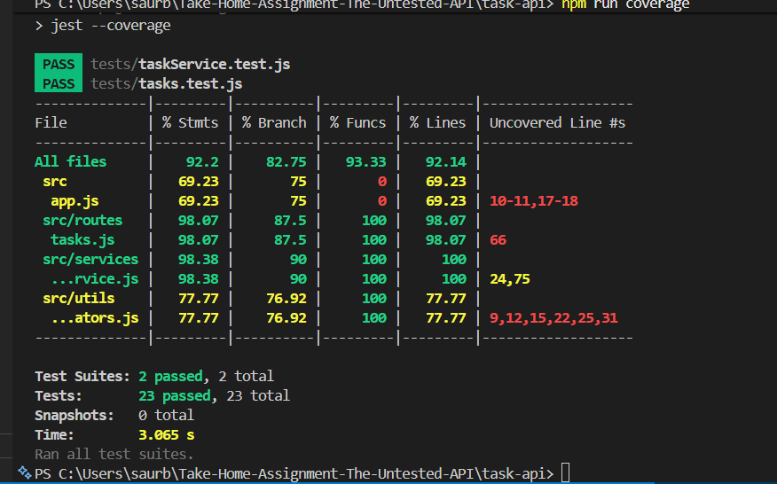

## Getting Started

**Prerequisites:** Node.js 18+

```bash
cd task-api
npm install
npm start        # runs on http://localhost:3000
```

**Tests:**

```bash
npm test
npm run coverage
```

---

## Project Structure

```text
task-api/
  src/
    app.js                  # Express app setup
    routes/tasks.js         # Route handlers
    services/taskService.js # Business logic + in-memory data store
    utils/validators.js     # Input validation helpers
  tests/                    # Test suite
  package.json
  jest.config.js
ASSIGNMENT.md               # Full brief
BUG_REPORT.md               # Bugs found during testing
```

> The data store is in-memory. It resets every time the server restarts.

---

## API Reference

| Method   | Path                  | Description |
|----------|-----------------------|-------------|
| `GET`    | `/tasks`              | List all tasks. Supports `?status=`, `?page=`, and `?limit=` |
| `POST`   | `/tasks`              | Create a new task |
| `PUT`    | `/tasks/:id`          | Update a task |
| `DELETE` | `/tasks/:id`          | Delete a task |
| `PATCH`  | `/tasks/:id/complete` | Mark a task as complete |
| `GET`    | `/tasks/stats`        | Counts by status plus overdue count |
| `PATCH`  | `/tasks/:id/assign`   | Assign a task to a user |

### Task shape

```json
{
  "id": "uuid",
  "title": "string",
  "description": "string",
  "status": "todo | in_progress | done",
  "priority": "low | medium | high",
  "dueDate": "ISO 8601 or null",
  "assignee": "string | null",
  "completedAt": "ISO 8601 or null",
  "createdAt": "ISO 8601"
}
```

### Sample requests

**Create a task**

```bash
curl -X POST http://localhost:3000/tasks \
  -H "Content-Type: application/json" \
  -d '{"title": "Write tests", "priority": "high"}'
```

**List tasks with filter**

```bash
curl "http://localhost:3000/tasks?status=todo&page=1&limit=10"
```

**Mark complete**

```bash
curl -X PATCH http://localhost:3000/tasks/<id>/complete
```

**Assign a task**

```bash
curl -X PATCH http://localhost:3000/tasks/<id>/assign \
  -H "Content-Type: application/json" \
  -d '{"assignee": "Morgan"}'
```

---

## Submission Notes

- Added Jest + Supertest coverage in `task-api/tests/taskService.test.js` and `task-api/tests/tasks.test.js`.
- Covered happy paths plus validation and not-found edge cases for the existing API, and added tests for `PATCH /tasks/:id/assign`.
- Fixed pagination to use one-based page numbers and tightened status filtering to exact matches.
- Current coverage: `92.2%` statements, `82.75%` branches, `93.33%` functions, `92.14%` lines.

## Coverage Summary

- Statements: 92.2%
- Branches: 82.75%
- Functions: 93.33%
- Lines: 92.14%
- Test suites: 2 passed, 2 total
- Tests: 23 passed, 23 total



### What I'd test next

I'd add tests for malformed JSON requests, invalid query parameters, and a few more edge cases around reassignment behavior. I'd also add more assertions around response shape and timestamp fields to make sure the API contract stays consistent.

### What surprised me

The biggest surprise was that a few important bugs showed up quickly once I started writing tests, especially around pagination and status filtering. They were small pieces of logic, but they would have been easy to miss without both service-level and route-level coverage.

### Questions before shipping

I'd want to confirm whether `PUT /tasks/:id` is meant to behave like a full replacement or a partial update, since the current behavior is closer to partial updates. I'd also ask whether reassigning a task should be allowed, and whether `PATCH /tasks/:id/complete` should preserve the existing priority instead of resetting it.
